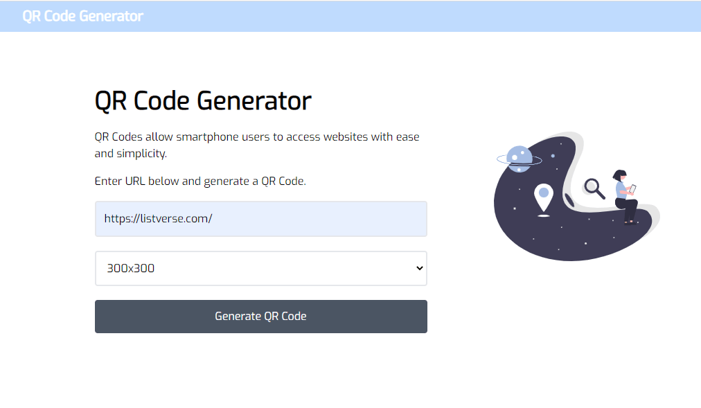

# QR-Code-Gen
QR Code Generator creates scannable and downloadable QR codes to a user specified url.
_built with Vanilla JavaScript, Tailwind-CSS, QRCode.JS Library & WinBox Library. From [Brad Traversy](https://www.youtube.com/watch?v=qNiUlml9MDk&list=LL&index=2&t=191s).

Demo: [Live Link](https://immanuel404.github.io/QR-Code-Gen/)

